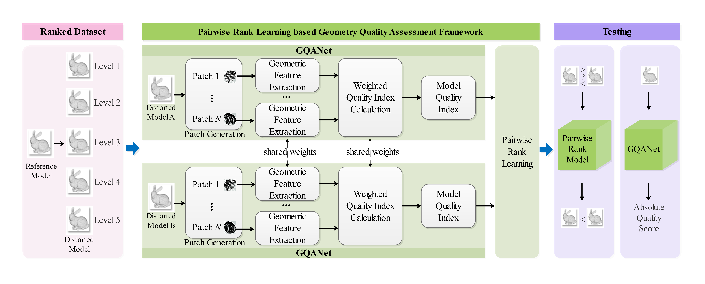

# PRL-GQA

A no-reference point-based geometry-only quality assessment framework based on deep pairwise rank learning, named `PRL-GQA`, and a new large-scale pairwise ranking learning dataset called `PRLD`.

# Overview

A pairwise rank learning framework for no-reference point cloud geometry-only quality assessment (`PRL-GQA`) is proposed, in which the geometric feature extraction, weighted quality index calculation, and pairwise rank learning are jointly optimized in an end-to-end manner.




A new rank dataset named `PRLD` is constructed, which includes 150 reference point clouds and 15750 pairs of distorted samples.


Our `PRLD` dataset is released at https://pan.baidu.com/s/1eD_1178tdh_Fg3VuAGiubA?pwd=8jt4.


# Run Program

Please copy the `PRLD` dataset in the program root directory

Run and train the model:

```shell
python train_test.py
```

Verify the performance:

```she	
python perfermance_validate.py
```


